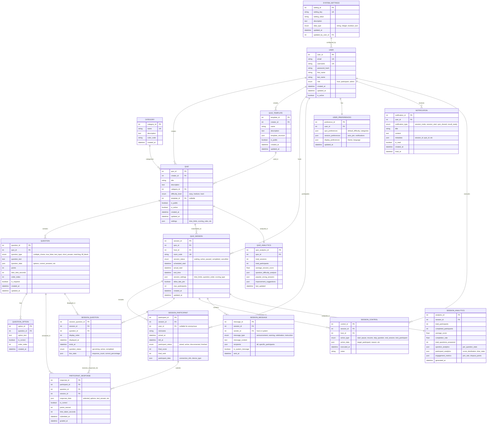

```mermaid
erDiagram
    %% User Management
    USER {
        int user_id PK
        string email UK
        string username UK
        string password_hash
        string first_name
        string last_name
        enum role "host, participant, admin"
        datetime created_at
        datetime updated_at
        boolean is_active
    }

    %% Quiz Structure
    QUIZ {
        int quiz_id PK
        int creator_id FK
        string title
        text description
        int category_id FK
        enum difficulty_level "easy, medium, hard"
        int template_id FK "nullable"
        boolean is_public
        boolean is_active
        datetime created_at
        datetime updated_at
        json settings "time_limits, scoring_rules, etc"
    }

    CATEGORY {
        int category_id PK
        string name UK
        text description
        string color_code
        datetime created_at
    }

    QUIZ_TEMPLATE {
        int template_id PK
        int creator_id FK
        string name
        text description
        json template_structure
        boolean is_public
        datetime created_at
        datetime updated_at
    }

    %% Question Management
    QUESTION {
        int question_id PK
        int quiz_id FK
        enum question_type "multiple_choice, true_false, text_input, short_answer, matching, fill_blank"
        text question_text
        json question_data "options, correct_answers, etc"
        int points
        int time_limit_seconds
        int order_index
        boolean is_required
        datetime created_at
        datetime updated_at
    }

    QUESTION_OPTION {
        int option_id PK
        int question_id FK
        text option_text
        boolean is_correct
        int order_index
        datetime created_at
    }

    %% Session Management
    QUIZ_SESSION {
        int session_id PK
        int quiz_id FK
        int host_id FK
        string room_code UK
        enum session_status "waiting, active, paused, completed, cancelled"
        datetime scheduled_start
        datetime actual_start
        datetime end_time
        json session_settings "time_limits, question_order, scoring_type"
        boolean allow_late_join
        int max_participants
        datetime created_at
        datetime updated_at
    }

    %% Participation
    SESSION_PARTICIPANT {
        int participant_id PK
        int session_id FK
        int user_id FK "nullable for anonymous"
        string nickname
        datetime joined_at
        datetime left_at
        enum participant_status "joined, active, disconnected, finished"
        int final_score
        int final_rank
        json participant_data "connection_info, device_type"
    }

    %% Responses and Scoring
    PARTICIPANT_RESPONSE {
        int response_id PK
        int participant_id FK
        int question_id FK
        int session_id FK
        json response_data "selected_options, text_answer, etc"
        boolean is_correct
        int points_earned
        int time_taken_seconds
        datetime submitted_at
        datetime graded_at
    }

    SESSION_QUESTION {
        int session_question_id PK
        int session_id FK
        int question_id FK
        int display_order
        datetime displayed_at
        datetime ends_at
        enum question_status "upcoming, active, completed"
        json live_stats "response_count, correct_percentage"
    }

    %% Real-time Session Control
    SESSION_CONTROL {
        int control_id PK
        int session_id FK
        int host_id FK
        enum action_type "start, pause, resume, skip_question, end_session, kick_participant"
        json action_data "target_participant, reason, etc"
        datetime executed_at
        string notes
    }

    %% Analytics and Reporting
    SESSION_ANALYTICS {
        int analytics_id PK
        int session_id FK
        int total_participants
        int completed_participants
        float average_score
        float completion_rate
        int total_questions_answered
        json question_analytics "per_question_stats"
        json participant_analytics "score_distribution, time_stats"
        json engagement_metrics "join_rate, dropout_points"
        datetime generated_at
    }

    QUIZ_ANALYTICS {
        int quiz_analytics_id PK
        int quiz_id FK
        int total_sessions
        int total_participants
        float average_session_score
        json question_difficulty_analysis
        json popular_wrong_answers
        json improvement_suggestions
        datetime last_updated
    }

    %% Notifications and Communication
    SESSION_MESSAGE {
        int message_id PK
        int session_id FK
        int sender_id FK "host or system"
        enum message_type "announcement, warning, celebration, instruction"
        text message_content
        json recipients "all, specific_participants"
        boolean is_system_message
        datetime sent_at
    }

    NOTIFICATION {
        int notification_id PK
        int user_id FK
        enum notification_type "session_invite, session_start, quiz_shared, result_ready"
        string title
        text content
        json metadata "session_id, quiz_id, etc"
        boolean is_read
        datetime created_at
        datetime read_at
    }

    %% Settings and Configuration
    USER_PREFERENCES {
        int preference_id PK
        int user_id FK
        json quiz_preferences "default_difficulty, categories"
        json session_preferences "auto_join, notifications"
        json display_preferences "theme, language"
        datetime updated_at
    }

    SYSTEM_SETTINGS {
        int setting_id PK
        string setting_key UK
        string setting_value
        text description
        enum data_type "string, integer, boolean, json"
        datetime updated_at
        int updated_by_user_id FK
    }

    %% Relationships
    USER ||--o{ QUIZ : creates
    USER ||--o{ QUIZ_TEMPLATE : creates
    USER ||--o{ QUIZ_SESSION : hosts
    USER ||--o{ SESSION_PARTICIPANT : participates
    USER ||--|| USER_PREFERENCES : has
    USER ||--o{ NOTIFICATION : receives
    USER ||--o{ SESSION_CONTROL : executes

    CATEGORY ||--o{ QUIZ : categorizes
    QUIZ_TEMPLATE ||--o{ QUIZ : "used_in"
    
    QUIZ ||--o{ QUESTION : contains
    QUIZ ||--o{ QUIZ_SESSION : "instantiated_as"
    QUIZ ||--|| QUIZ_ANALYTICS : "analyzed_in"

    QUESTION ||--o{ QUESTION_OPTION : has
    QUESTION ||--o{ PARTICIPANT_RESPONSE : "answered_in"
    QUESTION ||--o{ SESSION_QUESTION : "displayed_in"

    QUIZ_SESSION ||--o{ SESSION_PARTICIPANT : includes
    QUIZ_SESSION ||--o{ SESSION_QUESTION : displays
    QUIZ_SESSION ||--o{ SESSION_CONTROL : controlled_by
    QUIZ_SESSION ||--o{ SESSION_MESSAGE : contains
    QUIZ_SESSION ||--|| SESSION_ANALYTICS : "analyzed_in"

    SESSION_PARTICIPANT ||--o{ PARTICIPANT_RESPONSE : submits
    
    SESSION_QUESTION ||--o{ PARTICIPANT_RESPONSE : "receives_responses_for"
    
    SYSTEM_SETTINGS ||--o{ USER : "configured_by"
```